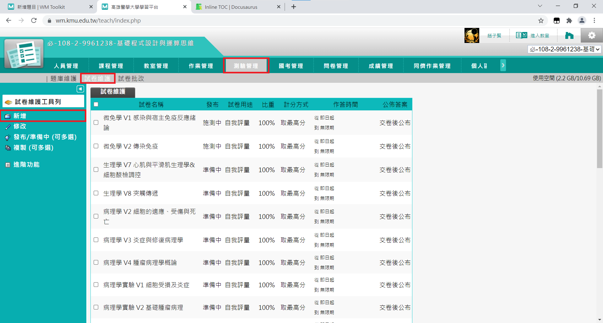
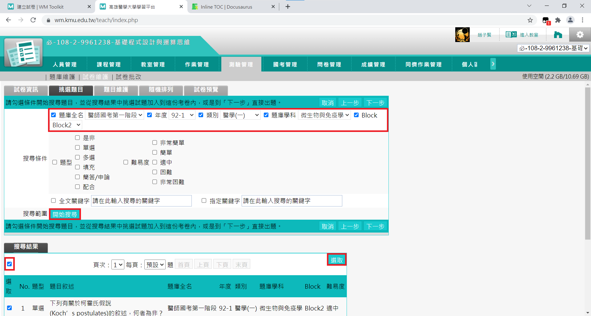

# 建立試卷

新增好該本共筆所有的考古後，是時候來建立了~

一樣在**測驗管理**的共工具列下方，有一個**試卷維護**的按鈕，接著點擊左方**新增**按鈕，就可以新增一份試卷。

## 編輯試卷資訊

大家在試卷資訊的介面中可以看到許多欄位，以下我會告訴大家個個欄位應該填寫什麼內容，如果有欄位下面沒有說明，則使用系統的預設值即可。

1. **試卷名稱**：按照*考古工作分配表*的範圍欄位填寫
2. **作答說明/師長叮嚀**：第一行請填考古年份，Ex: M107~M105 考古，第二行請填寫你的名字，Ex: 編撰：趙子賢
3. **發布**：發布
4. **測驗對象**：點擊修改按鈕，將標題設為 Block，並點擊下方個別帳號的按鈕，系統會跳出一張修課名單，請將所有參與考古製作的人員勾選，並點選確認，關閉前請確認所有人都有在個別帳號的欄位中，接著點選確定。
5. **測驗次數**：0
6. **公布答案**：作答完公布→公布成績、作答結果及標準答案

完成後即可點擊下一步。

:::tip 提示
這部分也相當繁瑣，因此在插件中也有相對應的快捷鍵幫助大家填寫上面的欄位，詳細的說明一樣會放在[插件使用](../extension/test-autofill.md)的章節中喔。
:::

## 挑選題目

點選**自姓由題庫挑題或直接出題**，系統便會顯示篩選功能表，請依照下列方式設定，就可以顯示剛剛做的題目：

1. **題庫全名**：醫師國考第一階段
2. **年度**：請依據*考古工作分配表*的年度欄位填寫
3. **類別**：醫學(ㄧ)
4. **題庫學科**：依據題目的科目而定
5. **Block**：依據題目的 Block 而定

接著就按下面的**開始搜尋**按鈕，你便可以看到剛剛製作的題目。

看到**搜尋結果**後，請勾選搜尋結果下方的欄位，便可將所有符合條件的題目勾選起來，接著再點右側的**選取**，就可以將所有題目納入試卷中了。

完成後一樣點擊下一步。

## 題目維護

點選左邊的**平均配分**按鈕，右方會跳出一個對話框，將總分設定為 100 分並確定。

## 隨機排列

勾選**啟用隨機**，並勾選**題目隨機排列**。

:::info 說明
由於考古製作時，詳解往往會按照題目選項做說明，因此我們不勾選選項隨機排列，以免選項對應不到詳解的內容。
:::

## 試卷預覽

完成上述所有的步驟後，系統會顯示試卷的預覽結果，這時請大家確認一下自己製作的試卷有沒有問題，如果沒有問題，點擊上方的**完成+存檔**就完成啦！

## 試卷排序

基本上到這裡已經成功地建立試卷了，然而由於考古的數量龐大（考試範圍有夠大…），因此我們需要一套良好的排序規則，才能讓大家想要練習考古時，能夠輕鬆地找到試卷，因此在建立完試卷後，請大家依照下面的步驟為考古排序。

1. 勾選你剛剛建立的試卷
2. 打開左側的**進階功能**工具列
3. 點選**上移**或**下移**便可移動試卷的位置

而排序的規則是先排**科目**，再排**單元**，科目請按照下面的順序排序：

1. 生理
2. 病理
3. 藥理
4. 胚胎
5. 寄蟲
6. 微免
7. 臨醫
8. 實驗診斷
9. 實證醫學

因此，生理 V1 會排在 生理 V3 之前，微免 V1 則會排在 寄蟲 V5 之後。
